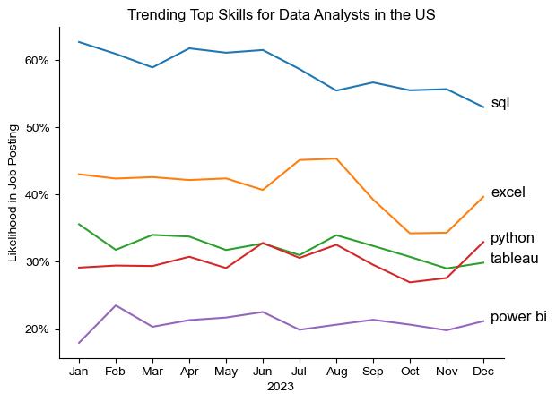

# The Analysis

## 1. What are the most demanded skills for the top 3 most popular data roles?

To identify the most in-demand skills for the top 3 most popular data roles, I filtered the dataset to focus on the most frequently occurring positions and extracted the top 5 skills associated with each of these roles. This analysis highlights the most sought-after job titles and their corresponding key skills, providing insight into the skills to prioritize based on the role of interest.

View my notebook with detailed steps here: [2_Skill_Demand.ipynb](3_Project/2_Skills_Count.ipynb)

### Visualize Data

```python
fig, ax = plt.subplots(len(job_titles), 1)


for i, job_title in enumerate(job_titles):
    df_plot = df_skills_perc[df_skills_perc['job_title_short'] == job_title].head(5)[::-1]
    sns.barplot(data=df_plot, x='skill_percent', y='job_skills', ax=ax[i], hue='skill_count', palette='dark:b_r')

plt.show()
```

### Results


*A bar graph showing salaries for the top 3 data roles and their top 5 associated skills.*

### Insights

- SQL is the most in-demand skill for both Data Analysts and Data Scientists, appearing in over half of the job postings for each role. For Data Engineers, Python is the top skill, listed in 68% of job postings.  
- Data Engineers tend to require more specialized technical expertise, such as AWS, Azure, and Spark, whereas Data Analysts and Data Scientists are expected to excel in more general data tools like Excel and Tableau.  
- Python is a versatile skill that is highly valued across all three roles, with the highest demand among Data Scientists (72%) and Data Engineers (65%).  

## 2. How are in-demand skills trending for Data Analysts?

To analyze skill trends for Data Analysts in 2023, I filtered job postings specific to data analyst roles and grouped the skills by the posting month. This allowed me to identify the top 5 skills for data analysts each month, highlighting their popularity over the course of 2023.

You can view my notebook with detailed steps here: [3_Skills_Trend](3_Skills_Trend.ipynb).

### Visualize Data

```python
from matplotlib.ticker import PercentFormatter

df_plot = df_DA_US_percent.iloc[:, :5]
sns.lineplot(data=df_plot, dashes=False, legend='full', palette='tab10')

plt.gca().yaxis.set_major_formatter(PercentFormatter(decimals=0))

plt.show()
````
### Results

  
*Bar chart showcasing the top trending skills for data analysts in the US during 2023.*

### Insights:
- SQL consistently remained the most in-demand skill throughout the year, though its demand gradually declined over time.  
- Excel saw a notable rise in demand starting in September, ultimately surpassing both Python and Tableau by year-end.  
- Python and Tableau maintained relatively stable demand throughout the year, with minor fluctuations, continuing to be key skills for data analysts. Power BI, while less in demand compared to the others, displayed a slight upward trend toward the end of the year.
