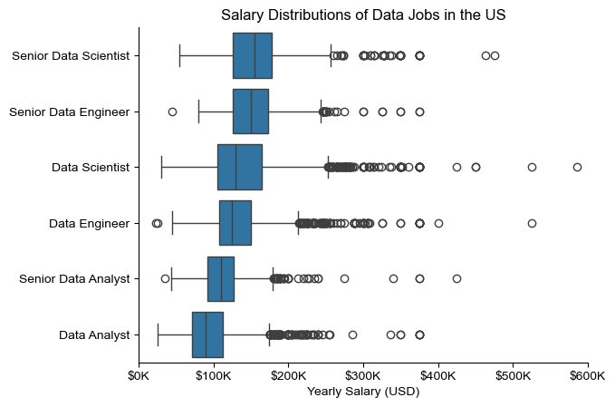

# The Analysis

## 1. What are the most demanded skills for the top 3 most popular data roles?

To identify the most in-demand skills for the top 3 most popular data roles, I filtered the dataset to focus on the most frequently occurring positions and extracted the top 5 skills associated with each of these roles. This analysis highlights the most sought-after job titles and their corresponding key skills, providing insight into the skills to prioritize based on the role of interest.

View my notebook with detailed steps here: [2_Skill_Demand.ipynb](3_Project/2_Skills_Count.ipynb)

### Visualize Data

```python
fig, ax = plt.subplots(len(job_titles), 1)


for i, job_title in enumerate(job_titles):
    df_plot = df_skills_perc[df_skills_perc['job_title_short'] == job_title].head(5)[::-1]
    sns.barplot(data=df_plot, x='skill_percent', y='job_skills', ax=ax[i], hue='skill_count', palette='dark:b_r')

plt.show()
```

### Results


*A bar graph showing salaries for the top 3 data roles and their top 5 associated skills.*

### Insights

- SQL is the most in-demand skill for both Data Analysts and Data Scientists, appearing in over half of the job postings for each role. For Data Engineers, Python is the top skill, listed in 68% of job postings.  
- Data Engineers tend to require more specialized technical expertise, such as AWS, Azure, and Spark, whereas Data Analysts and Data Scientists are expected to excel in more general data tools like Excel and Tableau.  
- Python is a versatile skill that is highly valued across all three roles, with the highest demand among Data Scientists (72%) and Data Engineers (65%).  

## 2. How are in-demand skills trending for Data Analysts?

To analyze skill trends for Data Analysts in 2023, I filtered job postings specific to data analyst roles and grouped the skills by the posting month. This allowed me to identify the top 5 skills for data analysts each month, highlighting their popularity over the course of 2023.

You can view my notebook with detailed steps here: [3_Skills_Trend](3_Skills_Trend.ipynb).

### Visualize Data

```python
from matplotlib.ticker import PercentFormatter

df_plot = df_DA_US_percent.iloc[:, :5]
sns.lineplot(data=df_plot, dashes=False, legend='full', palette='tab10')

plt.gca().yaxis.set_major_formatter(PercentFormatter(decimals=0))

plt.show()
````
### Results

  
*Bar chart showcasing the top trending skills for data analysts in the US during 2023.*

### Insights:
- SQL consistently remained the most in-demand skill throughout the year, though its demand gradually declined over time.  
- Excel saw a notable rise in demand starting in September, ultimately surpassing both Python and Tableau by year-end.  
- Python and Tableau maintained relatively stable demand throughout the year, with minor fluctuations, continuing to be key skills for data analysts. Power BI, while less in demand compared to the others, displayed a slight upward trend toward the end of the year.

## 3. How well do jobs and skills pay for Data Analysts?

### Salary Analysis for Data Nerds

Check out my notebook with detailed steps here: [4_Salary_Analysis](4_Salary_Analysis.ipynb).

#### Visualize Data

```python
sns.boxplot(data=df_US_top6, x='salary_year_avg', y='job_title_short', order=job_order)

ticks_x = plt.FuncFormatter(lambda y, pos: f'${int(y/1000)}K')
plt.gca().xaxis.set_major_formatter(ticks_x)
plt.show()
```
#### Results

  
*A box plot illustrating the salary distributions for the top 6 data-related job titles.*

#### Insights

- There is a notable variation in salary ranges across different job titles. Senior Data Scientist roles stand out with the highest earning potential, reaching up to $600K, highlighting the industry's high demand for advanced data expertise and experience.

- Both Senior Data Engineer and Senior Data Scientist positions exhibit a significant number of high-end outliers, indicating that exceptional skills or unique circumstances can result in substantial compensation. In comparison, Data Analyst roles show more consistent salaries with fewer outliers.

- Median salaries tend to rise with the level of seniority and specialization. Senior roles, such as Senior Data Scientist and Senior Data Engineer, not only command higher median salaries but also exhibit greater variability in earnings, reflecting the increased complexity and responsibility associated with these positions.

### Highest Paid & Most Demanded Skills for Data Analysts

Next, I refined my analysis to focus specifically on Data Analyst roles. I examined the highest-paying skills and the most in-demand skills, presenting the findings using two bar charts.

#### Visualize Data

```python

fig, ax = plt.subplots(2, 1)  

# Top 10 Highest Paid Skills for Data Analysts
sns.barplot(data=df_DA_top_pay, x='median', y=df_DA_top_pay.index, hue='median', ax=ax[0], palette='dark:b_r')

# Top 10 Most In-Demand Skills for Data Analystsr')
sns.barplot(data=df_DA_skills, x='median', y=df_DA_skills.index, hue='median', ax=ax[1], palette='light:b')

plt.show()

```

#### Results
Here’s an overview of the highest-paying and most in-demand skills for Data Analysts in the United States:


*Two distinct bar charts illustrating the highest-paying skills and the most in-demand skills for Data Analysts in the United States.*

#### Insights:

- The top chart reveals that specialized technical skills such as `dplyr`, `Bitbucket`, and `Gitlab` are linked to higher salaries, with some reaching up to $200K. This indicates that advanced technical expertise significantly boosts earning potential.

- The bottom chart shows that foundational skills like `Excel`, `PowerPoint`, and `SQL` are the most sought-after, even though they may not lead to the highest salaries. This underscores the essential role these core skills play in securing data analysis positions.

- There is a distinct difference between the skills associated with the highest salaries and those most in demand. To maximize career opportunities, data analysts should aim to build a well-rounded skill set that incorporates both high-paying specialized skills and widely demanded foundational skills.